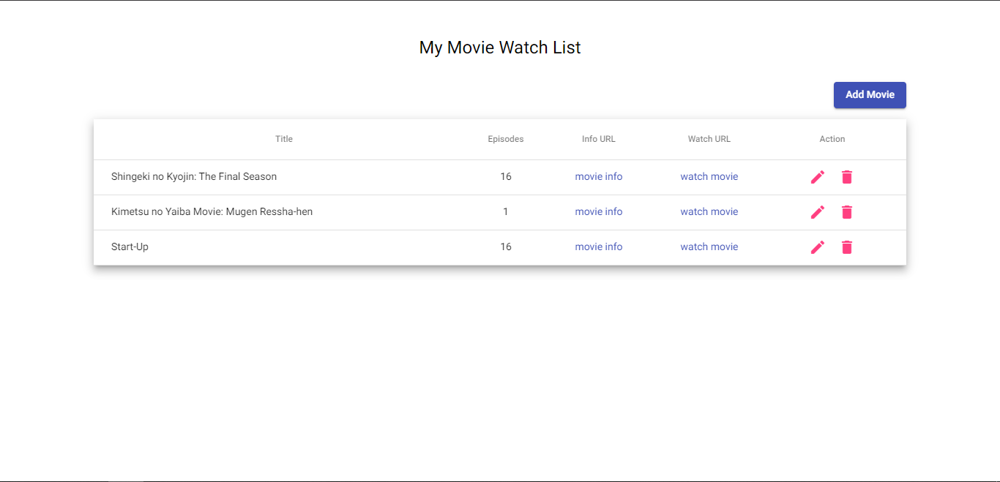
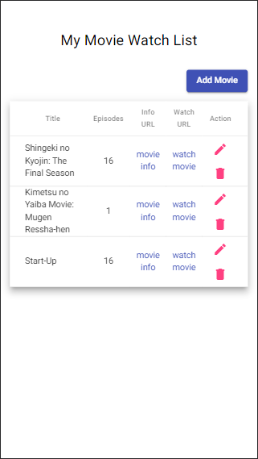

# MovieWatchList

This is the solution to the challange from [ZettaByte Pte Ltd](https://www.zettabyte.sg/).

## Table of contents

- [Overview](#overview)
  - [The challenge](#the-challenge)
  - [Screenshot](#screenshot)
  - [Links](#links)
- [My process](#my-process)
  - [Built with](#built-with)
  - [Deploy to](#deploy-to)

## Overview

### The challenge

Recreating My Movie Watch List app with form control based on [this](https://my-movie-watch-list.vercel.app/)

### Screenshot

#### Desktop

#### Mobile

### Links

- Solution URL: [GitHub](https://github.com/jojomanurung/MovieWatch-List)
- Live Site URL: [My Movie Watch List](https://my-moviewatch-list.netlify.app/)

## My process

### Built with

- Generated and build with [Angular CLI](https://github.com/angular/angular-cli) version 11.2.5
- [Material Angular](https://material.angular.io/) version 11.2.5
- CSS custom properties

### Deploy to

- [Netlify](https://netlify.com)
